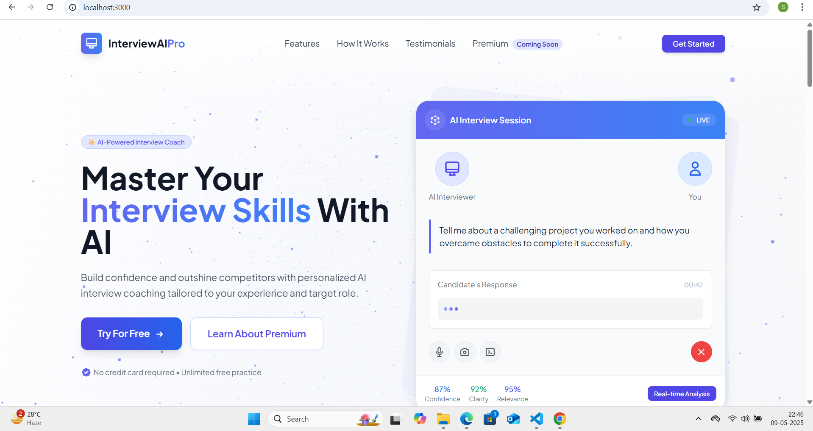
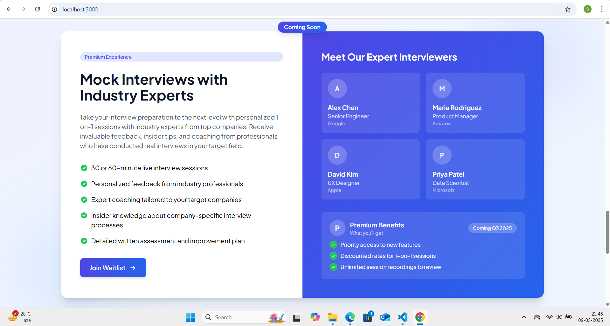
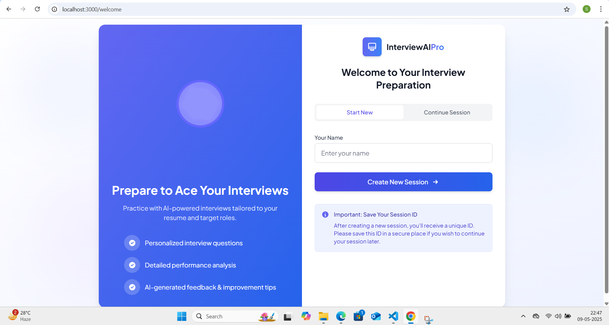
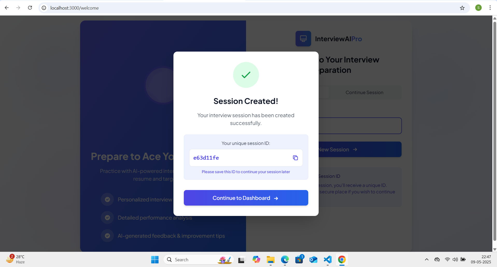
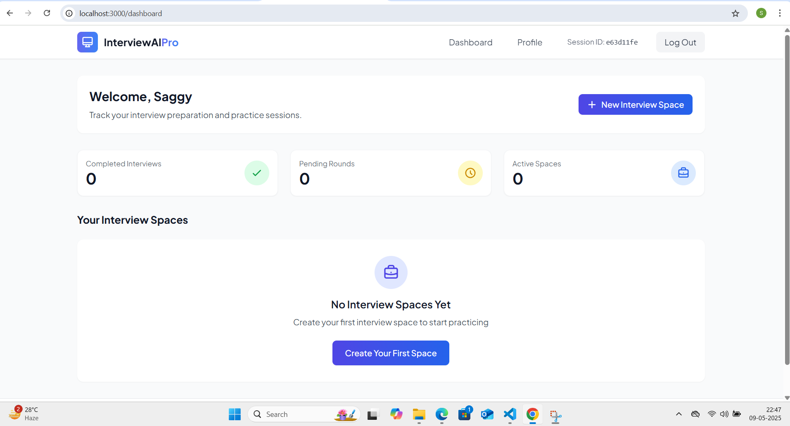
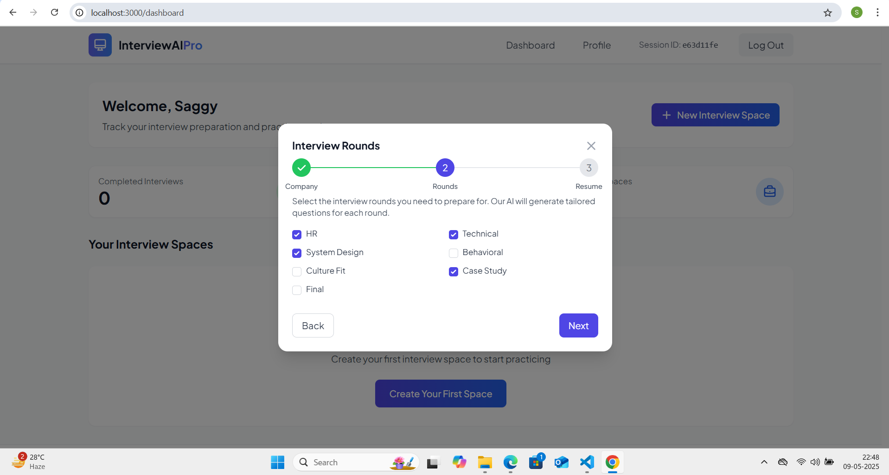
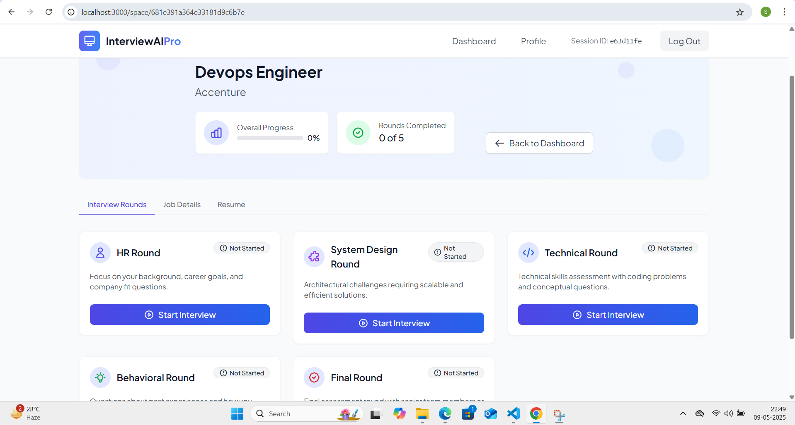
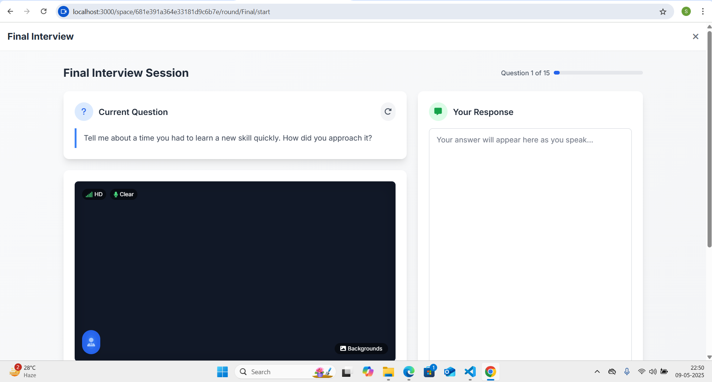

# InterviewAI Pro


InterviewAI Pro is an innovative platform that helps users prepare for job interviews through AI-powered mock interviews, personalized feedback, and performance analytics.

[](./LICENSE)

## 🌟 Features

- **AI-Powered Interviews**: Simulate realistic interview experiences tailored to specific job positions
- **Voice Recognition**: Practice answering questions verbally with speech-to-text technology
- **Real-time Feedback**: Get instant feedback on your answers during practice sessions
- **Comprehensive Analysis**: Receive detailed performance reports on communication, technical knowledge, and problem-solving
- **Interview Spaces**: Create dedicated spaces for different job applications
- **Resume Analysis**: Upload your resume for more personalized interview questions
- **Multiple Interview Rounds**: Practice different types of interviews (HR, Technical, Behavioral, etc.)

## 📋 Table of Contents

- [Demo](#demo)
- [Tech Stack](#tech-stack)
- [Project Structure](#project-structure)
- [Installation](#installation)
- [Environment Setup](#environment-setup)
- [Usage](#usage)
- [API Documentation](#api-documentation)
- [Contributing](#contributing)
- [License](#license)
- [Acknowledgements](#acknowledgements)

## 🎬 Demo











## 💻 Tech Stack

### Frontend
- React.js
- Tailwind CSS
- Framer Motion for animations
- React Router v6
- Axios for API requests
- Speech recognition API

### Backend
- Node.js
- Express.js
- MongoDB with Mongoose
- Google Generative AI (Gemini)
- JWT/Cookie Sessions for authentication
- Multer for file uploads
- PDF Parser and Mammoth for document processing

## 🏗️ Project Structure

```
interview-ai-pro/
├── client/                  # React frontend
│   ├── public/              # Static files
│   ├── src/                 # Source code
│   │   ├── assets/          # Images, icons, animations
│   │   ├── components/      # Reusable UI components
│   │   ├── contexts/        # React context providers
│   │   ├── hooks/           # Custom React hooks
│   │   ├── pages/           # Page components
│   │   ├── services/        # API services
│   │   ├── utils/           # Helper functions
│   │   ├── App.js           # Main component
│   │   └── index.js         # App entry point
│   └── package.json         # Frontend dependencies
│
├── server/                  # Node.js backend
│   ├── config/              # Configuration files
│   ├── controllers/         # API controllers
│   ├── middleware/          # Custom middleware
│   ├── models/              # MongoDB models
│   ├── routes/              # API routes
│   ├── app.js               # Express app setup
│   └── server.js            # Server entry point
│
├── public/                  # Shared public assets
│   └── Resumes/             # Uploaded resumes
│
├── .env                     # Environment variables (create from .env-example)
├── .env-example             # Example environment file
├── .gitignore               # Git ignore file
├── package.json             # Root dependencies
└── README.md                # Project documentation
```

## 🚀 Installation

### Prerequisites
- Node.js (v16 or higher)
- npm or yarn
- MongoDB (local or Atlas)
- Google Generative AI API key

### Clone the repository
```bash
git clone https://github.com/yourusername/interview-ai-pro.git
cd interview-ai-pro
```

### Install dependencies
```bash
# Install root dependencies
npm install

# Install client dependencies
cd client
npm install

# Install server dependencies
cd ../server
npm install
```

## ⚙️ Environment Setup

1. Copy the `.env-example` file and rename it to `.env`:
```bash
cp .env-example .env
```

2. Open the `.env` file and add your specific configuration:
```
# Server Configuration
PORT=5000
NODE_ENV=development

# MongoDB Connection
MONGO_URI=mongodb://localhost:27017/interviewai-pro
# or your MongoDB Atlas connection string
# MONGO_URI=mongodb+srv://<username>:<password>@cluster.mongodb.net/interviewai-pro

# Session
SESSION_SECRET=your_session_secret_here

# Google Generative AI (Gemini)
GEMINI_API_KEY=your_gemini_api_key_here
```

3. Create the necessary directories:
```bash
mkdir -p public/Resumes
```

## 🎮 Usage

### Development Mode
```bash
# Start both client and server in development mode
npm run dev

# To run only the server
npm run server

# To run only the client
npm run client
```

### Production Mode
```bash
# Build the client
npm run build

# Start the production server
npm start
```

### Accessing the Application
- Frontend: http://localhost:3000
- Backend API: http://localhost:5000/api

## 📚 API Documentation

### Authentication Endpoints

| Method | Endpoint | Description |
|--------|----------|-------------|
| POST   | /api/session/start-new | Create a new session |
| POST   | /api/session/continue | Continue with existing session |
| GET    | /api/session/profile | Get user profile |
| POST   | /api/session/update-profile | Update user profile |
| GET    | /api/session/end | End current session |

### Interview Spaces Endpoints

| Method | Endpoint | Description |
|--------|----------|-------------|
| GET    | /api/spaces | Get all spaces |
| POST   | /api/spaces/create | Create a new space |
| GET    | /api/spaces/:id | Get space details |
| GET    | /api/spaces/resume/:id | Download resume |

### Interview Endpoints

| Method | Endpoint | Description |
|--------|----------|-------------|
| GET    | /api/interview/:spaceId/:roundName/generate-questions | Generate questions for a round |
| POST   | /api/interview/:spaceId/:roundName/finish | Finish an interview round |
| GET    | /api/interview/questions-answers/:roundId | Get questions and answers |

For more detailed API documentation, check the API [documentation folder](./docs/api.md) *(Create this documentation if needed)*

## 🤝 Contributing

Contributions are welcome! Please feel free to submit a Pull Request.

1. Fork the repository
2. Create your feature branch (`git checkout -b feature/AmazingFeature`)
3. Commit your changes (`git commit -m 'Add some AmazingFeature'`)
4. Push to the branch (`git push origin feature/AmazingFeature`)
5. Open a Pull Request

Please read [CONTRIBUTING.md](CONTRIBUTING.md) for details on our code of conduct and the process for submitting pull requests.

## 📃 License

This project is licensed under the GNU GPL v3 with an additional Non-Commercial restriction - see the [LICENSE](LICENSE) file for details.

Key points:
- You can use, modify, and distribute this software for non-commercial purposes
- Any modified version must also be open source under the same license terms
- You cannot sell this software or derivatives commercially
- Commercial use requires explicit permission from the project owners

## 🙏 Acknowledgements

- [Google Generative AI](https://ai.google.dev/) for providing the AI capabilities
- [React](https://reactjs.org/) for the frontend framework
- [Tailwind CSS](https://tailwindcss.com/) for the styling
- [Express](https://expressjs.com/) for the backend framework
- [MongoDB](https://www.mongodb.com/) for the database
- [Font Awesome](https://fontawesome.com/) for the icons

---

Created with ❤️ by [Your Name](https://github.com/yourusername)

For questions or support, please [open an issue](https://github.com/yourusername/interview-ai-pro/issues) or contact: your.email@example.com